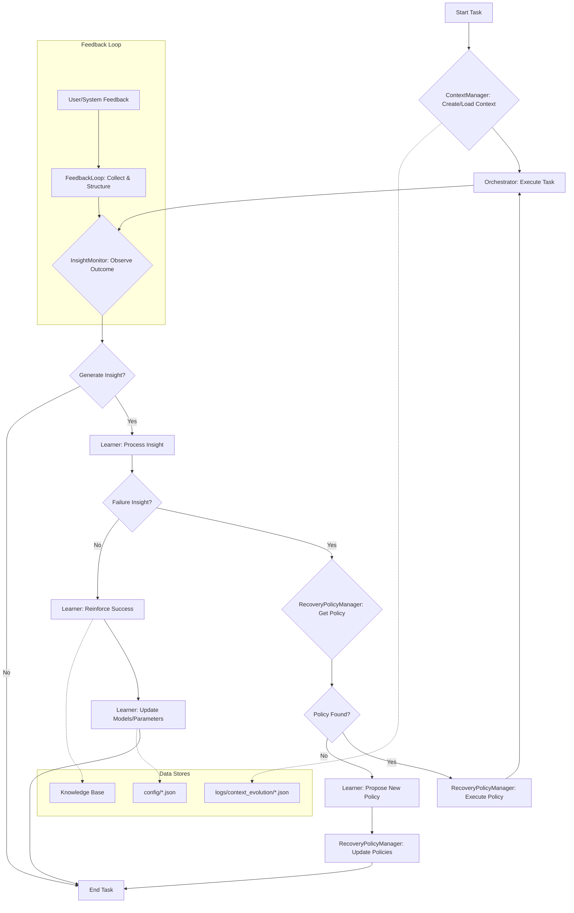

# SSP - Context Evolution Framework Specification

## 1. Overview

The Context Evolution Framework is a core subsystem of the Shiroi System Platform (SSP) designed to enable autonomous learning, adaptation, and recovery. It provides a structured mechanism for the AI to understand its operational context, monitor its performance, learn from feedback, and dynamically adjust its behavior and internal models.

This framework moves beyond static, predefined logic by creating a continuous loop of introspection, analysis, and evolution, allowing the SSP to become more robust, efficient, and intelligent over time.

## 2. Core Components

The framework consists of five primary components that work in concert:

### 2.1. ContextManager

-   **`orchestrator/context_manager.py`**
-   **Responsibility**: Manages the creation, persistence, and retrieval of the AI's operational context. It aggregates data from various sources (e.g., user input, system state, persona profile, historical logs) into a structured `Context` object.
-   **Key Functions**:
    -   `create_context()`: Builds a new context for a given task or session.
    -   `load_context()`: Retrieves a historical context.
    -   `update_context()`: Modifies the current context with new information.
    -   `log_context_history()`: Persists the context and its evolution over time for future analysis.

### 2.2. InsightMonitor

-   **`orchestrator/insight_monitor.py`**
-   **Responsibility**: Continuously analyzes the outcomes of the AI's actions and the evolution of its context. It identifies meaningful patterns, anomalies, successes, and failures, translating them into actionable `Insights`.
-   **Key Functions**:
    -   `monitor_outcomes()`: Observes the results of tasks executed by the orchestrator.
    -   `detect_patterns()`: Identifies recurring trends or significant deviations in performance or data.
    -   `generate_insight()`: Creates a structured `Insight` object that encapsulates a finding, its supporting evidence, and its potential impact.

### 2.3. Learner

-   **`orchestrator/learner.py`**
-   **Responsibility**: The central learning unit of the framework. It processes `Insights` generated by the `InsightMonitor` to update the AI's internal models, parameters, and knowledge base.
-   **Key Functions**:
    -   `process_insight()`: Analyzes an `Insight` to determine the appropriate learning action.
    -   `update_models()`: Modifies configuration files (e.g., `config/model_params.json`, `config/persona_profile.json`) based on the learning.
    -   `assimilate_knowledge()`: Integrates new, validated information into the AI's knowledge base (e.g., RAG engine data).
    -   `propose_recovery_policy()`: When a failure pattern is detected, it can propose a new `RecoveryPolicy` to the `RecoveryPolicyManager`.

### 2.4. RecoveryPolicyManager

-   **`orchestrator/recovery_policy_manager.py`**
-   **Responsibility**: Manages a repository of `RecoveryPolicies`. These policies are predefined strategies for handling specific, known error conditions or failure modes.
-   **Key Functions**:
    -   `get_policy()`: Retrieves a suitable recovery policy for a given error type.
    -   `execute_policy()`: Runs the steps defined in a recovery policy (e.g., retry with different parameters, switch to a fallback model, trigger a self-healing routine).
    -   `update_policy()`: Modifies or adds new policies, often based on proposals from the `Learner`.

### 2.5. FeedbackLoop

-   **`orchestrator/feedback_loop_integration.py`**
-   **Responsibility**: Gathers and integrates explicit feedback from users and implicit feedback from system performance into the learning cycle.
-   **Key Functions**:
    -   `collect_feedback()`: Gathers evaluation scores, comments, and other forms of feedback.
    -   `structure_feedback()`: Converts raw feedback into a format that can be processed by the `InsightMonitor`.
    -   `trigger_learning_cycle()`: Initiates a new learning cycle based on received feedback.

## 3. Workflow and Data Flow

The components interact in a continuous, cyclical workflow:

1.  **Context Creation**: The `ContextManager` assembles the initial `Context` for a task.
2.  **Action & Observation**: The main `Orchestrator` executes the task. The `InsightMonitor` observes the outcome.
3.  **Insight Generation**: The `InsightMonitor` analyzes the outcome and generates an `Insight` if a significant pattern is found. This could be a success, a failure, or a subtle trend.
4.  **Learning**: The `Learner` receives the `Insight`.
    -   If it's a success, the `Learner` may reinforce the parameters or knowledge that led to it.
    -   If it's a failure, it first checks with the `RecoveryPolicyManager` for an existing policy.
5.  **Recovery (if applicable)**:
    -   If a `RecoveryPolicy` exists, the `RecoveryPolicyManager` executes it.
    -   If no policy exists, the `Learner` analyzes the failure `Insight` to propose a new, potential `RecoveryPolicy`.
6.  **Adaptation**: The `Learner` updates the relevant system parameters, models, or knowledge bases.
7.  **Feedback Integration**: The `FeedbackLoop` collects any explicit user feedback on the outcome, which is fed back into the `InsightMonitor` to start a new cycle.
8.  **History Logging**: Throughout the process, the `ContextManager` logs the context's state changes to `logs/context_evolution/`, creating a timeline for meta-analysis.

## 4. Key Concepts

-   **Context**: A snapshot of all relevant information for a task. It is dynamic and evolves as the task progresses.
-   **Insight**: A structured piece of knowledge derived from observing the system's behavior. It is the atomic unit of learning.
-   **Recovery Policy**: A predefined, executable plan to mitigate a specific, known failure mode.
-   **Contract**: A formal agreement (`contracts/*.py`) defining the expected inputs and outputs for a module, ensuring predictable interactions within the framework.

## 5. Future Work

-   **Meta-Learning**: Implement a higher-level process to analyze the evolution of recovery policies and learning strategies themselves.
-   **Proactive Simulation**: Develop the ability to use historical context data to simulate potential outcomes of different strategies before applying them in a live environment.
-   **Cross-Instance Learning**: Create a mechanism to share and aggregate insights and learned policies across multiple running instances of the SSP.