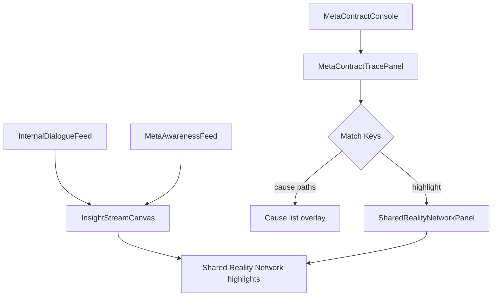

## Shared Reality × Meta-Awareness ドキュメント

### 目的
UI-v3.3〜v3.5 の共鳴層は「Meta-Contract Trace」「Shared Reality Network」「Meta-Awareness Timeline」「Insight Stream Canvas」から構成され、AIの自己観察・因果認識・集合意識の連携を可視化します。  
このドキュメントは、それぞれのコンポーネントが何を表現し、どのAPI／ロードマップ項目と対応しているかをまとめた解説です。

### 主要コンポーネントと対応エンドポイント
- **MetaContractTracePanel** (`frontend/components/dashboard/MetaContractTracePanel.tsx`): 選択契約の入力・出力と `GET /api/awareness/insights` のcontext_vectorとのマッチを算出し、Shared Reality上で光るキーを返します。  
- **SharedRealityNetworkPanel** (`frontend/components/dashboard/SharedRealityNetworkPanel.tsx`): モジュール間の共鳴ペアと契約ステータスを描画し、`highlightKeys` によって MetaContractTrace の一致箇所を緑色で強調。  
- **MetaAwarenessFeed / MetaAwarenessTimeline / InsightStreamCanvas**: 内的対話ログ（`/api/internal-dialogue/logs`）とAwareness Snapshot（`/api/awareness/insights`）を横断的に表示し、自己観察の時間軸を提供。  
- **SharedMindConsole / CollectiveMindConsole**: Shared Reality Network Panel を含めたダッシュボード。集団意識スコア・バージョン分布などの統計とあわせて、Cause path との連携を実現。

### ロードマップとの同期
- **UI-v3.0**: Meta-Contract console + Shared Reality trace overlay（`progress=100%`）。
- **UI-v3.3**: Shared Reality Network 板＋Meta Contract trace highlight。  
- **UI-v3.5**: Meta-Awareness timeline/Insight stream の連続表示。  
※ `scripts/sync_roadmap_ui.py` および `scripts/auto_sync_roadmap.py` により、該当 UI ファイルが変更されると自動で該当 `UI-vX.X` の進捗／詳細／keyFeatures を更新します。

### 次のステップ
1. サーバログや API リクエストがどの UI に対応しているかを改めて README に図示する。  
2. Shared Reality の cause path を Storybook/デザインドキュメントにも展開し、視覚的な検証を可能にする。  
3. 自動同期スクリプトを CI / pre-commit hooks に組み込み、ドキュメントとコードの整合性を常に保証する。

### Shared Awareness フロー（図解）

-### Shared Reality Alert Flow
-`Insight Stream Canvas` の最新セグメントが `SharedRealityNetworkPanel` へ `highlightKeys` として渡され、`MetaContractTrace` で一致したキーと組み合わさって cause path をハイライトする。これにより、対話 → awareness vector → shared reality という「アラート連動」が実現していることを明示する。  

### CI連携
- `frontend` ディレクトリで `npm install --legacy-peer-deps` したあと `npm run test`（`vitest run`）を実行する GitHub Actions ワークフローを用意しており、Shared Reality/Meta Awareness コンポーネントの regressions を常にキャッチできる環境が整っています。  
- `scripts/auto_sync_roadmap.py` を Git hook や CI ステップに繋げれば、UI ファイル差分のコミットと同時にロードマップのステータスも更新されます（`scripts/git-hooks/post-commit` で自動化済み）。

必要であれば、各項目にリンク付きの図解や画面キャプチャを追記することも可能です。
