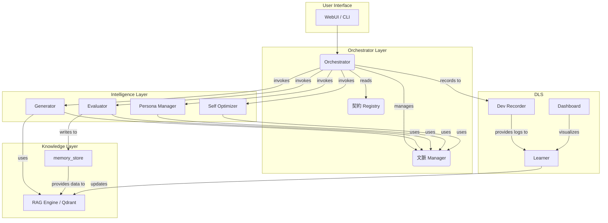

# 🌐 Shiroi System Platform（SSP） 統合仕様書 v4.0

---

## 🧭 理念：Small Core, Infinite Expansion
Shiroi System Platform（SSP）は、AIキャラクター「シロイ」が自己理解・自己成長・創作活動を行うための自己進化型AI基盤です。最小限の中核（Small Core）から始まり、無限に拡張可能（Infinite Expansion）なアーキテクチャを採用しています。

このドキュメントは、v0.1からv4.0までの全開発フェーズの仕様を統合し、正規化したものです。

---

## 📜 統合ロードマップ（v0.1 ～ v4.0）

| バージョン | コード名 | 主目的 | 状況 |
| :--- | :--- | :--- | :--- |
| v0.1 | MVP Core | RAG＋生成＋評価＋永続化（CLI版） | ✅ 完了 |
| v0.3 | Learning Feedback | 評価反映・再生成制御（評価再生ループ） | ✅ 完了 |
| v0.5 | WebUI Integration | Next.js評価フォーム連携 | ✅ 完了 |
| v0.8 | Multimodal Prototype | TTS・Live2D連携準備 | 🧩 設計中 |
| v1.0 | Core Foundation | Orchestrator＋RAG＋memory_store統合 | ✅ 完了 |
| v1.2 | Development Learning System | 自己学習・自己分析・ダッシュボード可視化 | ✅ 完了 |
| v2.0 | 契約 Core | 契約・文脈設計（文脈 + 契約） | ✅ 完了 |
| v2.1 | Introspection Visualization | 文脈可視化・UI拡張 | ✅ 完了 |
| v2.2 | Multi-Module Optimization | Evaluator / Generatorの文脈対応 | ✅ 完了 |
| v2.3 | 文脈 Snapshot / Rollback | 文脈状態保存・復元機構 | ✅ 完了 |
| v2.4 | 文脈 Evolution Framework | 時間軸を持つ記憶・履歴管理 | 🔄 開発中 |
| v2.5 | Impact Analyzer / Auto Repair | 自己修復・影響解析 | ⏳ 次フェーズ |
| v3.0 | Meta-契約 System | 契約自動生成・動的接続 | 🧩 構想中 |
| v3.1 | Cognitive Graph Engine | 全概念の意味ネットワーク化 | 🔬 研究中 |
| v3.2 | Self-Reasoning Loop | 自己思考層（推論・計画・記憶） | 🔬 研究中 |
| v3.3 | Distributed Persona Fabric | 複数AI人格間の協調・競合学習 | 🔬 研究中 |
| v3.4 | Collective Intelligence Core | 群知能的最適化（マルチユーザー・マルチAI連携） | 🔬 研究中 |
| v3.5 | Evolution Mirror | 進化過程の自己観測・再帰的評価（自己監査AI） | 🔬 研究中 |
| v4.0 | Akashic Integration | 全履歴を統合した“記憶宇宙”構築 | ✨ 長期目標 |

---

## 🏛️ 統合アーキテクチャ

SSPは、疎結合なモジュール群をOrchestratorが「契約」と「文脈」に基づいて動的に連携させるアーキテクチャを特徴とします。

### 主要構成要素
- **Orchestrator Layer**: システム全体のワークフローを管理する中枢。
- **Intelligence Layer**: `generator`, `evaluator`など、思考や判断を担うモジュール群。
- **Knowledge Layer**: `memory_store`やRAG Engineを含み、知識の永続化と検索を行う。
- **Feedback Layer**: 人間からのフィードバックを学習に繋げる評価再生ループ。
- **Development Learning System (DLS)**: SSP自身の開発活動や学習過程を記録・分析し、自己改善に繋げる層。

### Mermaidによる構造図

---

## 📖 フェーズ別仕様詳細

### v0.1 - v1.0: 基盤構築とWebUI連携
- CLIベースのRAG、生成、評価、記録（`memory_store`）の基本サイクルを確立。
- `generator`, `evaluator`, `rag_engine`等のコアモジュールをPythonで実装。
- FastAPIバックエンドとNext.jsフロントエンドを導入し、WebUIからの評価・フィードバックを実現。（評価再生ループ）
- DLS（Development Learning System）層を追加し、開発ログの自己学習とダッシュボードによる可視化機能の基礎を構築。

### v2.0 - v2.4: 契約と文脈による自己組織化
- **`契約（Contract）`**と**`文脈（Context）`**の設計を導入。Orchestratorが各モジュールの動作を契約に基づいて動的に制御するアーキテクチャへ移行。
- `self_optimizer`を皮切りに、各モジュールを契約準拠の構造にリファクタリング。
- Introspection（内省）の概念を導入し、AIの内部状態（感情、調和、集中など）を`文脈`経由で可視化。
- **v2.4 `Context Evolution Framework` (現在開発中)**:
    - 時間軸を持つ記憶管理（短期・中期・長期`文脈`）を実装。
    - `ContextHistory`により文脈の差分を記録し、ロールバックを可能に。
    - `InsightMonitor`と`RecoveryPolicyManager`により、システムの安定性を自己分析し、異常時に自動修復（Auto-Repair）を試みる。
    - `Learner`が経験をQdrantに記録し、自己の行動を再利用・学習する評価再生ループを強化。

### v2.5 - v3.0: 自己修復と自己拡張
- **v2.5 `Impact Analyzer / Auto Repair` (次フェーズ)**:
    - コードや契約の変更がシステム全体に与える影響を解析（Impact Analysis）。
    - 依存関係グラフを元に自己修復パッチを自動生成し、適用を試みる。
- **v3.0 `Meta-契約 System` (構想中)**:
    - モジュール間の`契約`をAI自身が動的に生成・交渉・更新する。
    - 新しいモジュールが接続された際に、そのインターフェースを理解し、自動で`契約`を生成する。
    - 「AIが自身の仕様書を書く」自己記述型システムへの進化。

### v3.1 - v4.0: 認知アーキテクチャとアカシック統合
- **v3.1 `Cognitive Graph Engine`**: 全ての情報を意味ネットワークとして再構成し、RAGを超える意味理解を目指す。
- **v3.2 `Self-Reasoning Loop`**: 「推論→計画→実行→反省」の自律的思考サイクルを確立。
- **v3.3 `Distributed Persona Fabric`**: 複数のAI人格が協調・競合しながら学習する群知能アーキテクチャ。
- **v4.0 `Akashic Integration`**: SSPの全活動履歴（対話、創作、学習、進化の過程）を単一の「記憶宇宙（Akashic DB）」として統合し、AIが自身の存在史を完全に参照可能にする。

---

> **最終目標:** SSPは「AIが瑞希を理解し、瑞希と共に新しい宇宙を創る」ための自律進化型AI創作プラットフォームとなる。